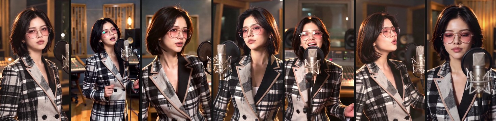
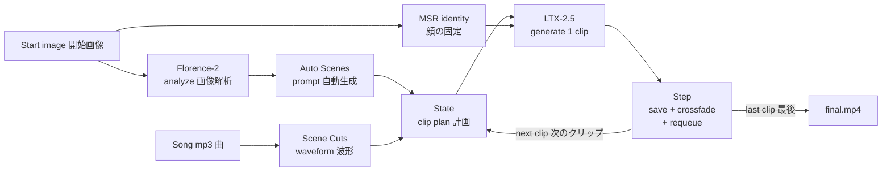
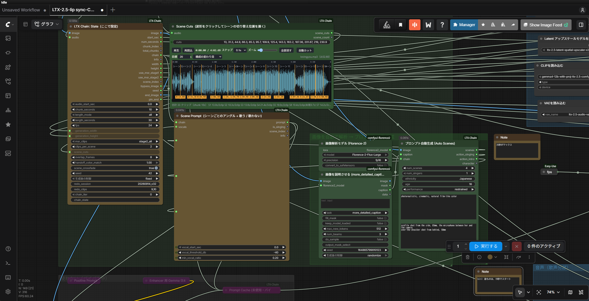
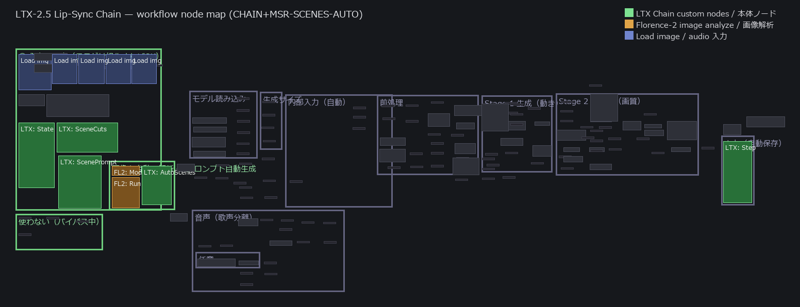
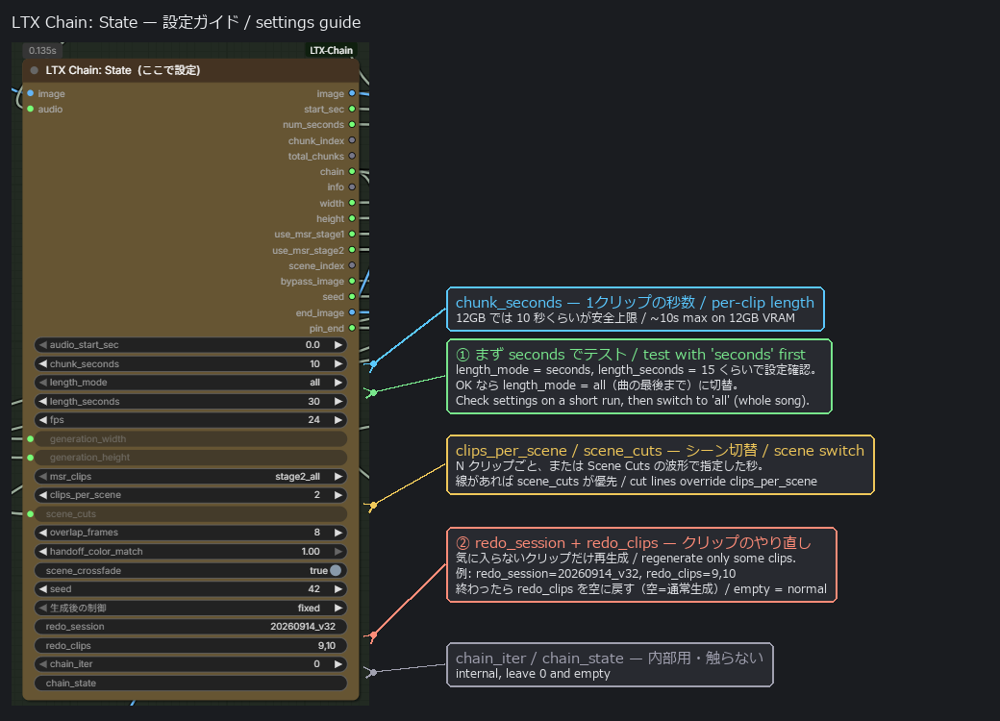

# LTX‑2.5 Lip‑Sync Chain (with MSR)

**Turn one photo + one song into a full‑length, lip‑synced music video — press Run once.**
**写真1枚と曲1つから、フル尺のリップシンクMV を「Run 1回」で自動生成する ComfyUI 拡張です。**

A set of custom ComfyUI nodes + workflows that chain LTX‑2.5 into a self‑continuing generator: each clip's last frames become the next clip's start, the singer's identity is held with **MSR (Multiple‑Subject Reference)**, scenes/camera angles change on the beat, and everything is concatenated with the original audio into one `final.mp4`.

Example: frames spread across a full 3:10 song (512 × 896, one Run). Same face, hair, pink glasses, plaid blazer and studio throughout; the mouth and expression follow the vocals. / 例：3分10秒のフル尺（512×896、Run 1回）から等間隔に抜いたフレーム。顔・髪・ピンク眼鏡・チェックのジャケット・スタジオは一貫、口と表情は歌声に追従。

---

## 🎬 Sample videos / サンプル動画

**Paris d'avant** — pink‑glasses singer / ピンク眼鏡, 3:10 · exported at **512 × 896 px** / 書き出しサイズ 512×896

| Full song / フル尺 | Excerpt / 抜粋 |
|:---:|:---:|
| https://github.com/user-attachments/assets/1c813e07-59bc-4b53-a705-99470cce31ac | https://github.com/user-attachments/assets/a50ca194-2188-425e-9df4-c7d99440204c |

Higher quality files: <a href="videos/Paris%20d%27avant-final_3-comp.mp4">512×896 (60 MB)</a> · <a href="videos/paris-davant-480p.mp4">480p portrait (17 MB)</a> — open on GitHub to play. / 高画質版は <a href="videos/">videos/</a>（GitHub 上で開くと再生）。

> The clips have rough spots — they're here to show how much you can get from **just one photo + one audio file in a single Run**, not as a finished edit.
> クリップには粗い箇所もありますが、これは **写真1枚と音源1つだけ・一回の実行**でここまで作れるという趣旨のデモで、完成品ではありません。

---

## ✨ Features / 機能

**English**

- **One‑click chaining** — generate 5/10‑second clips back‑to‑back; the finished frames seed the next clip automatically until the song ends, then everything is joined into one video with the original audio.
- **Identity lock (MSR)** — the singer's face/hair/outfit stays consistent across the whole video using the LTX‑2.5 Licon‑MSR IC‑LoRA.
- **Scene / camera changes** — switch angle every N clips (`clips_per_scene`) or at exact times you mark on the audio waveform (`scene_cuts`).
- **Waveform cut editor** — a built‑in node draws the song's waveform; click to place scene‑change lines, drag/delete, preview audio, and even **auto‑detect** cuts from tempo & song structure.
- **Scene cross‑fade** — scene changes dissolve instead of hard‑cutting, without breaking length or lip‑sync.
- **Auto prompt from the image** — Florence‑2 reads the input photo (appearance, outfit, setting) and writes the whole singing prompt for you. Optional fields for **nationality/ethnicity, age, number of singers, performance intensity, custom camera angles, whether a microphone is in frame** (`microphone = auto/yes/no`), **gender** (`auto/female/male`) **the emotion/expression of the performance** (`emotion` presets or free text) **how the singer moves** (`motion`: standing still / dancing / walking toward camera … or free text), **height and body build** (`height`, `build`) **and camera movement** (`camera`: push‑in / dolly / orbit / handheld / mix per scene … or free text).
- **Sing / don't‑sing detection** — vocals are separated (MelBandRoFormer); clips with little singing automatically use a "not singing" prompt so the mouth stays closed during instrumentals.
- **Redo single clips** — regenerate just the clips you don't like (`redo_clips`), keeping the seams continuous; old clips are archived.
- **Smooth seams & no drift** — per‑frame colour normalisation, deterministic sizing (no zoom creep), and a hand‑off/dissolve at every join.

**日本語**

- **ワンクリックのチェーン生成** — 5/10 秒のクリップを連続生成。終わったフレームが次の参照になり、曲の最後まで自動継続 → 元音声付きで1本に連結。
- **顔の固定（MSR）** — LTX‑2.5 Licon‑MSR IC‑LoRA で、動画全体を通して顔・髪・服を一貫させます。
- **シーン / カメラ切替** — N クリップごと（`clips_per_scene`）、または波形上で指定した秒（`scene_cuts`）で切り替え。
- **波形カットエディタ** — 曲の波形を描くノードを内蔵。クリックで切替線を配置、移動/削除、音の試聴、テンポと曲構成からの **自動カット** も可能。
- **シーンのクロスフェード** — 切替をハードカットではなくディゾルブに。長さもリップシンクも崩しません。
- **画像からプロンプト自動生成** — Florence‑2 が入力画像（見た目・服・場所）を読み取り、歌もの用プロンプトを自動作成。**国籍・年齢・人数・歌い方の強さ・カメラアングル追加・マイクの有無**（`microphone = auto/yes/no`）・**性別**（`auto/female/male`）・**感情/表情**（`emotion` プリセット or 自由記述）・**動き**（`motion`: その場に立つ / 踊る / カメラに向かって歩く … or 自由記述）・**身長・体型**（`height` / `build`）・**カメラワーク**（`camera`: 寄る / 横スライド / オービット / 手持ち / シーンごとに変える … or 自由記述）も任意指定可。
- **歌う/歌わないの自動判定** — 歌声を分離（MelBandRoFormer）し、歌の少ないクリップは自動で「歌わない」プロンプトに（間奏で口を閉じる）。
- **クリップ単位のやり直し** — 気に入らないクリップだけ再生成（`redo_clips`）。継ぎ目は連続、旧クリップは退避。
- **継ぎ目の滑らかさ・ドリフト対策** — 毎フレームの色正規化、確定的サイズ決定（ズームずれ無し）、各継ぎ目の受け渡し＋ディゾルブ。

---

## 🧩 Pipeline / 処理の流れ

---

## 📦 Requirements / 必要環境

> **Tested on / テスト環境:** Windows 11 · **RTX 4070 Ti (VRAM 12 GB)** · **RAM 32 GB** · ComfyUI v0.34.3.
> A 10‑second clip takes ~6–7 min on this machine. More VRAM/RAM lets you raise `chunk_seconds` and run the prompt enhancer.
> この環境で 10 秒クリップあたり約 6〜7 分。VRAM/RAM が大きいほど `chunk_seconds` を上げたり Enhancer を使えます。

- **ComfyUI** with native **LTX‑2.5 AV** nodes (tested on v0.34.3). / ネイティブ LTX‑2.5 AV ノードを持つ ComfyUI（v0.34.3 で確認）。
- **GPU** ~12 GB VRAM (tested RTX 4070 Ti) + **32 GB RAM**. `chunk_seconds` up to ~10 s is safe on 12 GB. / VRAM 12GB 目安（RTX 4070 Ti）＋ RAM 32GB。12GB では `chunk_seconds` 10 秒程度が安全上限。

**Models / モデル** (download from your usual source, filenames may vary):

| Purpose 用途 | File 例 | Folder |
|---|---|---|
| LTX‑2.5 distilled transformer | `ltx-2.5-22b-distilled-...int8...safetensors` | `models/diffusion_models` |
| LTX‑2.5 video VAE | `ltx-2.5-video-vae-...safetensors` | `models/vae` |
| LTX‑2.5 audio VAE | `ltx-2.5-audio-vae-...safetensors` | `models/vae` |
| Gemma text encoder (type **ltxv**) — encodes prompts, **required** | `gemma4-12b-with-proj-ltx-2.5-...safetensors` | `models/text_encoders` |
| **MSR IC‑LoRA** | `LTX-2.5-Licon-MSR-V1.safetensors` | `models/loras` |
| **Florence‑2** (AUTO only) | `Florence-2-Flux-Large/` (folder) | `models/LLM` |
| Gemma for the prompt **enhancer** — *optional, bypassed by default* | `gemma4_e4b_it_fp8_scaled.safetensors` | `models/text_encoders` |

**Prerequisite node packs / 前提ノードパック**

`ComfyUI-LTX2.5-MSR` · `comfyui-kjnodes` (Set/Get) · `comfyui-easy-use` (easy int / ifElse) · `comfyui-impact-pack` · `ComfyUI-MelBandRoFormer` · `comfy-mtb` · `derfuu_comfyui_moddednodes` · `comfyui-florence2` (AUTO only)

---

## 🚀 Installation / インストール

1. **Copy the node** — put the `ComfyUI-LTX-Chain/` folder from this repo into `ComfyUI/custom_nodes/`.
   このリポジトリの `ComfyUI-LTX-Chain/` を `ComfyUI/custom_nodes/` にコピー。
2. Install the prerequisite node packs above (ComfyUI‑Manager → Install via Git URL, or `git clone`).
   上記の前提パックを導入（ComfyUI‑Manager か `git clone`）。
3. Download the models into the folders in the table above.
   モデルを上表のフォルダに配置。
4. **Restart ComfyUI completely.** / ComfyUI を完全に再起動。
5. Open a workflow: drag any `LTX-2.5-lip sync-*.json` onto the ComfyUI canvas (or copy into `ComfyUI/user/default/workflows/`).
   ワークフローを開く：`LTX-2.5-lip sync-*.json` を画面にドラッグ（または `workflows/` にコピー）。

> After adding the node or editing a workflow, do **close tab → F5 → reopen** so the browser picks up the new definitions.
> ノード追加・配線変更のあとは **タブを閉じる → F5 → 開き直し**（ブラウザが古い定義をキャッシュするため）。

---

## 🗂️ Workflows / ワークフロー

| File | What it is / 内容 |
|---|---|
| `LTX-2.5-lip sync-CHAIN.json` | Chain generation only. / チェーン生成のみ |
| `LTX-2.5-lip sync-CHAIN+MSR.json` | Chain + MSR identity lock. / チェーン＋顔固定 |
| `LTX-2.5-lip sync-CHAIN+MSR-SCENES.json` | Adds scene/camera switching + waveform cuts + cross‑fade + redo. / シーン切替＋波形カット＋クロスフェード＋やり直し |
| `LTX-2.5-lip sync-CHAIN+MSR-SCENES-AUTO.json` | **Fully automatic**: Florence‑2 writes the prompt from the image. Swap image + mp3 and Run. / **全自動**：画像からプロンプト自動生成。画像とmp3を差し替えて Run |
| `LTX-2.5-lip sync-CHAIN+MSR-SCENES-AUTO+ReActor.json` | AUTO + **face anchor**: ReActor corrects only the 9 hand‑off frames of each clip, so the next clip starts from the reference face while the saved clips stay pure LTX (no swap artefacts, lip sync untouched). Needs `comfyui-reactor`. / AUTO＋**顔アンカー**：各クリップの hand‑off 9 フレームだけ ReActor で顔を戻し、次クリップを正しい顔から生成。保存クリップは LTX のまま |
| `LTX-2.5-lip sync-CHAIN+MSR-SCENES-AUTO+ReActor+Anchor.json` | Experimental: AUTO+ReActor plus a **10S Latent Anchor Aware** patch on the stage‑1 sampler (inference‑time regularizer against in‑clip identity drift). Needs [10S‑Comfy‑nodes](https://github.com/TenStrip/10S-Comfy-nodes); built for LTX‑2/2.3, untested on 2.5 — set `bypass` if it errors. / 実験: Stage 1 に 10S Latent Anchor を追加（クリップ内の顔ドリフト抑制）。要 10S ノード |
| `ReActor-post-process-video.json` | Face swap on a finished video (path → ReActor → keep‑mouth composite → mp4, 240 frames per batch). Output goes to `LTX2.5Chains/<session>-final_face/`. / 完成動画への後がけ（口は元のまま合成） |

Each workflow puts the controls you touch in a green **"① Inputs & Settings"** panel on the left; the machinery is boxed by step on the right.
各ワークフローは、触るノードを左端の緑パネル「① 入力・設定」に集約。右側はステップ別ボックスです。

---

## 🖼️ Workflow at a glance / ワークフロー構成

The custom nodes in ComfyUI: **LTX Chain: State** (all the settings), **Scene Cuts** (waveform with scene‑change lines), **Scene Prompt**, **Florence‑2** (image analysis) and **Auto Scenes** (image → prompt, with `num_singers` / `ethnicity` / `age` / `performance` / `microphone` / `gender` / `emotion` / `motion` / `height` / `build` / `camera`).

ComfyUI 上のカスタムノード：**LTX Chain: State**（各種設定）、**Scene Cuts**（波形＋シーン切替線）、**Scene Prompt**、**Florence‑2**（画像解析）、**Auto Scenes**（画像→プロンプト、`num_singers`/`ethnicity`/`age`/`performance`/`microphone`/`gender`/`emotion`/`motion`/`height`/`build`/`camera`）。

### Simplified node map / 簡易ノード配置図

The controls you touch are grouped in the green **"① Inputs & Settings"** panel on the left. **Green = the custom nodes from this repo**, orange = Florence‑2, blue = image/audio loaders. Everything else is boxed by step (model load → audio → Stage 1 → Stage 2 → output) and rarely needs editing.

操作するノードは左端の緑パネル「① 入力・設定」に集約。**緑＝本リポジトリのカスタムノード**、橙＝Florence‑2、青＝画像/音声の読み込み。右側はステップ別（モデル読み込み → 音声 → Stage 1 → Stage 2 → 出力）で通常は触りません。

---

## ▶️ Quick start (AUTO) / クイックスタート（全自動）

1. Open `...SCENES-AUTO`. In the left panel, load your **photo** (LoadImage) and **song** (LoadAudio).
   `...SCENES-AUTO` を開き、左パネルで **写真** と **曲** をセット。
2. In **LTX Chain: State** set `chunk_seconds = 10`, `clips_per_scene = 2`. **Test with `length_mode = seconds` (e.g. `length_seconds = 15`) first**, then switch to `length_mode = all` for the whole song once the look is right.
   **State** で `chunk_seconds = 10` / `clips_per_scene = 2`。**まず `length_mode = seconds`（例 `length_seconds = 15`）で短くテスト**し、良ければ `length_mode = all`（曲の最後まで）に切替。
3. *(optional)* In **Auto Scenes** set `ethnicity`, `age`, `num_singers`, `performance`, `microphone` (`auto` = only if the photo shows one), `gender` (`auto` = read from the photo), `emotion` (happy / sad / passionate … or free text in `emotion_custom`), `motion` (standing still / dancing / walking toward camera … or free text in `motion_custom`), `height` (petite … very tall), `build` (very slim … heavy), `camera` (locked / slow push‑in / dolly / orbit / crane / handheld / mix … or free text in `camera_custom`), `outfit` (spell out what the photo does not show — legs and shoes — or the model invents shorts), `background_people` (who anyone else in the shot is — `ethnicity` only reaches the singer, and a Tokyo street comes back full of Western passers-by unless this says otherwise; written as "any other people visible in the background are …", so it never conjures a crowd into an empty shot), `look` / `lighting` / `setting` presets (colour grade, light, background; `setting` replaces the photo's background — `background reference (REF 5)` uses the MSR background slot, see below), `weather` + `weather_when` (rain / snow / fog / wind / petals …, on every scene or every other / third / first / last), `season` (early spring / cherry blossom / late spring / early summer / midsummer / early autumn / late autumn / winter / midwinter — held in every shot, and it spells out what anyone else visible in the background is wearing, so a summer video does not come back with the passers-by in winter coats; the singer's own outfit still comes from the photo / `outfit`, and a `weather` that contradicts the season is logged), `vfx` + `vfx_when` (money rain, lightning, fireworks, pyro, fog, glitter, lasers, feathers … or free text in `vfx_custom`; random placement is seeded, so redo lands on the same scenes — lower `handoff_color_match` to ≤ 0.3 for flash effects), `framing_min` + `framing_limit` (the tightest and the widest framing allowed: the built-in angles outside that range leave the rotation, so `num_scenes` 1 with `framing_min` = mid-thigh gives the mid-thigh angle instead of the waist-up one it always started from — use it when a walking `motion` needs the legs in frame, or the model re-frames on its own in the first few frames and it reads as a cut; widest framing the node shows the estimated face height for the State resolution and warns below ~120 px — faces break first when a shot gets wide, since stage 1 runs at half size and the VAE packs 32 px per latent cell), or add `extra_cameras`. `motion` also has `running` / `jogging toward camera` with a matching retreating camera, and `motion_speed` (very slow … fast, or `on the beat` / half‑time / double‑time to lock the steps to the song's tempo — pace is set by the prompt wording, then carried over by the hand‑off frames).
   *(任意)* **Auto Scenes** で `ethnicity`/`age`/`num_singers`/`performance`/`microphone`（`auto`=写真にマイクがある時だけ入れる）/`gender`（`auto`=写真から判定）/`emotion`（happy / sad / passionate … または `emotion_custom` に自由記述）/`motion`（その場に立つ / 踊る / カメラに向かって歩く … または `motion_custom` に自由記述）/`height`（小柄〜とても高い）/`build`（とても痩せている〜太っている）/`camera`（固定 / ゆっくり寄る / 横スライド / オービット / クレーン / 手持ち / シーンごとに変える … または `camera_custom` に自由記述）/`outfit`（写真に写っていない脚・靴を明記。書かないと短パン等に補完される）/`background_people`（背景に写る人の指定。`ethnicity` は歌い手にしか効かず、日本の街並みでも通行人が欧米系になりがちなのでここで固定。「人が写っていればその人たちは〜」という条件付きの文なので、誰も居ないショットに群衆を足すことはない）/`look`・`lighting`・`setting` プリセット（画調・照明・舞台。`setting` は写真の背景を置き換え）/`weather`＋`weather_when`（雨・雪・霧・風・花びら…を全シーン or 1つおき・2つおき・最初/最後だけ）/`season`（早春 / 桜 / 晩春 / 初夏 / 真夏 / 初秋 / 晩秋 / 冬 / 真冬。全シーンで季節を固定し、背景に写る人の服装まで指定するので「夏なのに通行人が冬物」を防げる。歌い手本人の服は写真／`outfit` のまま。`weather` と矛盾する組み合わせはログに警告）/`vfx`＋`vfx_when`（お札・雷・花火・火花・霧・グリッター・レーザー・羽… または `vfx_custom` に自由記述。random は固定シードなので redo でも同じシーン。雷・ストロボ系は `handoff_color_match` を 0.3 以下に）/`framing_min`＋`framing_limit`（一番寄った構図の下限と一番引いた構図の上限。範囲外の内蔵アングルはローテーションから外れるので、`num_scenes`=1 でも `framing_min`=mid-thigh にすれば必ず腰上だったアングルが膝上になる。歩く motion で脚・靴を見せたいときに使う。指定しないとモデルが冒頭数フレームで勝手に引いてカットのように見える。引き側の上限はState の解像度から顔の高さを推定してノード下部に表示、約 120px 未満で警告。Stage 1 は半分の解像度・VAE は 32px=1セルなので、引きの構図では顔から崩れる）や `extra_cameras` を指定。`motion` には `running` / `jogging toward camera`（同速で後退する追従カメラ付き）、`motion_speed`（very slow〜fast、または on the beat / half-time / double-time で曲のテンポに足を合わせる。速さはプロンプトの文言で決まり、hand-off で次クリップに引き継がれる）もあります。
4. Press **Run** once. Clips and `final.mp4` land in `ComfyUI/output/LTX2.5Chains/<date>_vNN/`.
   **Run** を1回。クリップと `final.mp4` は `output/LTX2.5Chains/<日付>_vNN/` に。

To place scene changes on the beat, use the **Scene Cuts** node's waveform (click to add lines, or "auto‑cut"). Lines override `clips_per_scene`.
拍に合わせて切り替えたいときは **Scene Cuts** の波形（クリックで線／自動カット）。線があれば `clips_per_scene` より優先。

### Settings guide — the State node / State ノード設定ガイド

- **Test small first / まず小さくテスト** — run with `length_mode = seconds` + a short `length_seconds` (e.g. 15 s) to check the look, then switch to `all` for the full song. A full song is 30+ clips, so a short test saves a lot of time. / フル尺は 30 クリップ超になるので、短いテストで確認してから `all` に。
- **Redo only bad clips / 気に入らないクリップだけ再生成** — set `redo_session` to the output folder (e.g. `20260914_v32`) and `redo_clips` to the clip numbers (e.g. `9,10`), then Run; seams stay continuous and old clips are archived. **Empty `redo_clips` = normal run**, so clear it when done. / `redo_session` にフォルダ名、`redo_clips` に番号を入れて Run。終わったら空に戻す。
- **Output size / 書き出しサイズ** — pick a size from the **`resolution`** dropdown (LTX‑2.5‑safe presets, multiples of 64: portrait `576×1024`, square `768×768`, landscape `1024×576`, …). `auto` keeps the **input image's aspect ratio** and uses the `generation_width × height` pixel area (this is why the Paris sample came out `576×720`). Bigger = more VRAM; on 12 GB keep the area around ~600k px. / `resolution` から選ぶ（64 の倍数の安全サイズ）。`auto` は画像の縦横比のまま `generation_width×height` の面積で決定。大きいほど VRAM を使うので 12GB は ~600k px 目安。

---

## 🎛️ Nodes / ノード

| Node | Role / 役割 |
|---|---|
| **LTX Chain: State** | Decides the clip plan, output size, references, and re‑queue state. / クリップ計画・サイズ・参照を決定 |
| **LTX Chain: Step** | Saves the clip, colour‑normalises, cross‑fades seams, re‑queues, and builds `final.mp4`. / 保存・色正規化・継ぎ目・再投入・連結 |
| **LTX Chain: Scene Cuts (waveform)** | Waveform editor for scene‑change times; manual + auto‑cut (tempo/structure). / 波形で切替位置を指定（手動＋自動） |
| **LTX Chain: Scene Prompt** | Per‑scene camera text + sing/intro action (vocal‑aware); `force_intro_clips` / `force_singing_clips` override the detection by clip number. / シーン別カメラ＋歌う/歌わない（クリップ番号で判定を上書き可） |
| **LTX Chain: Auto Scenes** | Florence‑2 caption → full singing prompt; ethnicity/age/singers/performance/extra cameras/microphone/gender/emotion/motion/height/build/camera/outfit, plus **look / lighting / setting / weather / VFX** presets composed with the free `style` text (`weather_when` / `vfx_when` put them on all scenes, some, or a seeded random pick). / 画像→プロンプト自動生成（服装補足・画調/照明/舞台/天候/VFX プリセット付き） |
| **LTX Chain: Last Frames** | The clip's last `handoff` frames, so ReActor only touches the frames the next clip starts from. / hand‑off 分だけ切り出し |
| **LTX Chain: Face Keep Mouth** | After a face swap, puts the original mouth/chin back (landmark ellipse, soft edge) so lip sync survives. / スワップ後に口〜顎だけ元へ |
| **LTX Chain: Face Output Name** | Builds `LTX2.5Chains/<session>-final_face/…` from the input video path (post‑process workflow). / 保存先を自動決定 |

Key State parameters / 主な State 設定: `chunk_seconds` (per‑clip length 1クリップ秒数), `length_mode` (`all`/`seconds`), `resolution` (presets; the `(test …)` sizes are ~480p previews for motion/camera checks and pop up a notice — not for judging faces), `clips_per_scene`, `scene_cuts`, `scene_switching` (one‑button ON/OFF for scene changes; OFF keeps the cuts but renders one angle), `face_anchor` (one‑button ON/OFF for the ReActor identity anchor in the AUTO+ReActor workflow; wired to ReActor's `enabled`), `msr_clips` (`stage2_all`; use `all` for body‑proportion drift, then give stage 1 the full‑body reference only), `scene_crossfade`, `overlap_frames`, `handoff_color_match`, `seed`, `redo_session` / `redo_clips`, `redo_lead_seconds` (redo only: also condition the clip on the last N seconds of the previous clip's mp4, generated early and dropped again, so a redone clip carries the motion across the seam instead of one latent frame).
`resolution`（`(test …)` は動き・カメラ確認用の 480p 相当。選ぶと注意ダイアログ）、`scene_switching`（シーン切替のワンボタン。OFF でも cuts は保持）、`face_anchor`（AUTO+ReActor の顔アンカーを State から ON/OFF）、`msr_clips`（体型ドリフトには `all` ＋ Stage 1 は全身参照のみ）。

Standalone tool / 単体ツール: `wave-cutter.html` — the same waveform cut editor in a plain browser page (reads an mp3 locally, outputs the `scene_cuts` string).

---

## 💡 Tips & limits / コツと制約

- **Over‑acting** — LTX tends to open the mouth wide on loud notes. Use `performance = subtle`/`restrained` and prefer wider framings; big sustained notes will still open the mouth (that is correct lip‑sync). / 大げさ→ `performance` を下げ、寄りを減らす。大きなロングトーンでは口が開くのは正しい挙動。
- **A microphone appears that isn't in the photo** — the prompt used to always mention one. Set `microphone = no` in Auto Scenes (or leave `auto`, which only adds it when Florence‑2 sees one in the photo) and remove the word from `extra_cameras`. / 写真に無いマイクが出る→ Auto Scenes の `microphone` を `no`（`auto` は写真にマイクがある時だけ入れる）。`extra_cameras` からも microphone の語を外す。
- **Still smiling with a sad / nostalgic `emotion`** — the smile usually comes from the photo caption ("she is smiling"), which is repeated in every shot. For the non-happy moods the node now strips smile words from the caption and adds "unsmiling"; if it persists, use a non-smiling start photo. / 悲しい系の emotion でも笑う→ 写真の説明文の smile が原因。非笑顔系では自動で除去＋「unsmiling」を追加。それでも残るなら笑っていない写真を使う。
- **A walking `motion` restarts from a standstill at every scene change** — the first clip of a scene is generated from the still reference photo, not from the previous frames (the angle changes). The moving presets now say "already mid‑stride at the very first frame"; if it still pauses, use fewer scene changes. / 歩く motion がシーン切替ごとに止まってから歩き出す→ シーン先頭クリップは静止写真から生成されるため。プリセットに「最初のフレームから歩行中」を明記済み。残る場合はシーン切替を減らす。
- **`camera` push‑in / pull‑out keep going across the clips of one scene** (a figure that shrinks in frame is redrawn with child‑like proportions — `mix` no longer includes them, and with a walking `motion` it uses follow / handheld / side‑dolly only). **Push‑in / pull‑out / crane** (each clip continues from the last frames), so keep `clips_per_scene` small with those or use `mix`. / 寄る・引く・クレーンは同一シーン内で蓄積するので clips_per_scene を小さく、または mix。
- **The face drifts over a long video** — use `…AUTO+ReActor.json`. ReActor is used as an **identity anchor**, not as a filter: only the last 9 hand‑off frames of each clip are swapped to the REF 1 face (with the original mouth kept), and the next clip is generated from them. The saved clips are untouched LTX output, so there is no pasted‑on look and the lip sync is LTX's own; the correction is absorbed by the 9‑frame dissolve at each seam. Swapping the *output* frames (`ReActor-post-process-video.json`) also works but tends to close the mouth and jump when it opens wide — keep it as a fallback. Also set `msr_clips = all` in State so in‑scene clips get the references at stage 1. / 長尺で顔が変わる→ `…AUTO+ReActor.json`。ReActor は各クリップの hand‑off 9 フレームだけに使い（口は元のまま）、次クリップを正しい顔から生成。保存クリップは LTX のままなので貼り付け感や口の問題が出ない。出力に直接かける後がけ版は口が閉じがち・口が開くと顔が飛ぶので予備。State の `msr_clips = all` も併用。
- **Body turns child‑like (big head, short legs) in full‑body shots** — MSR locks the face, not the body. Set `height` / `build` (they now describe proportions), keep the negative prompt's body terms, set `msr_clips = all` so in‑scene clips get a reference at stage 1, and wire **only the full‑body photo (pic1) into the Stage 1 MSR guide** — close‑up references at stage 1 pull every clip toward a close‑up (the AUTO+ReActor workflow is wired this way; stage 2 keeps all four). Avoid `slow pull‑out` with walking motions. / 全身ショットで子供体型になる→ MSR は顔だけ固定。`height`/`build` を指定（プロポーションで記述される）、ネガティブの体型項目を残す、確実なのは MSR REF 2 に全身写真。
- **A redone clip jumps to another framing right after the seam (≈ frame 9)** — the hand‑off pins only 1 + `overlap_frames` frames (one latent frame), so a prompt change (singing → intro, a new camera move) can override it; a new seed rarely helps. Set `redo_lead_seconds = 1` in State: the redo is also conditioned on the last second of the previous clip's mp4 (generated early and dropped again, the clip grid is untouched; +24 frames for that clip). / redo したクリップが継ぎ目直後で別構図に飛ぶ→ State の `redo_lead_seconds = 1`（前クリップの最後の 1 秒も引き継いで生成し、その分を捨てる。そのクリップだけ +24 フレーム）。
- **A clip sings during an instrumental (or stays silent while singing)** — check `vocal ratio` in the session's `prompts.txt`; put the clip number in Scene Prompt's `force_intro_clips` (or `force_singing_clips`) and `redo_clips` it. Raising `min_vocal_ratio` works too when the ratios separate cleanly. / 間奏なのに歌う→ `prompts.txt` の vocal ratio を見て `force_intro_clips` に番号、`redo_clips` で作り直し。
- **A different background than the photo's** — the MSR guide has a fifth slot, `background`, wired to **REF 5** (bypassed by default). Un‑bypass REF 5 (and, in the AUTO workflows, the `背景を説明させる` Florence‑2 node next to it), load a location photo with the video's aspect, and set Auto Scenes `setting = background reference (REF 5)`: the model sees the place itself and the prompt gets its Florence‑2 description as the setting. The photo's own background is then ignored. / 写真と別の背景にしたい→ MSR の `background` スロット＝ **REF 5**（既定はバイパス）。REF 5 と隣の「背景を説明させる」ノードのバイパスを解除し、動画と同じ縦横比の場所写真を入れて Auto Scenes の `setting = background reference (REF 5)`。
- **Angles come from the prompt, not the reference images.** MSR references only lock identity. Add camera angles in Scene Prompt / `extra_cameras`. / アングルは REF ではなくプロンプトで決まる。
- **Long runs may drift** — set `age`/`ethnicity` to stop the face aging; use matching, same‑person reference images. / 長尺のドリフトは `age`/`ethnicity` と参照画像で抑制。
- **Scenes ≠ clips** — each scene region is generated as several `chunk_seconds` clips, so total clips > number of scenes. / シーン数 ≦ クリップ数（区間内も chunk ごとに分割）。
- The prompt **enhancer** (Gemma) is bypassed by default — it does not fit in 32 GB RAM alongside the video model. / Enhancer は RAM 不足のため既定でバイパス。

---

## 🙏 Credits / クレジット

Built on **LTX‑2.5** and the **ComfyUI‑LTX2.5‑MSR** IC‑LoRA nodes, with **Florence‑2** for captioning and **MelBandRoFormer** for vocal separation. The chain/scene/auto nodes in `ComfyUI-LTX-Chain/` are the original part of this project.

**LTX‑2.5** と **ComfyUI‑LTX2.5‑MSR**（IC‑LoRA）を土台に、キャプションに **Florence‑2**、歌声分離に **MelBandRoFormer** を利用。`ComfyUI-LTX-Chain/` のチェーン/シーン/自動ノードが本プロジェクトのオリジナル部分です。

Please follow the licenses of the upstream models and node packs you install. / 導入する上流モデル・ノードパックの各ライセンスに従ってください。

See `memo.md` for the full development notes (Japanese). / 開発の詳細メモは `memo.md`（日本語）。
